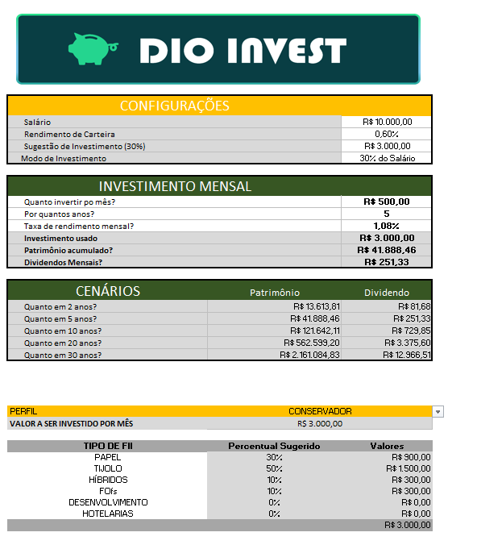
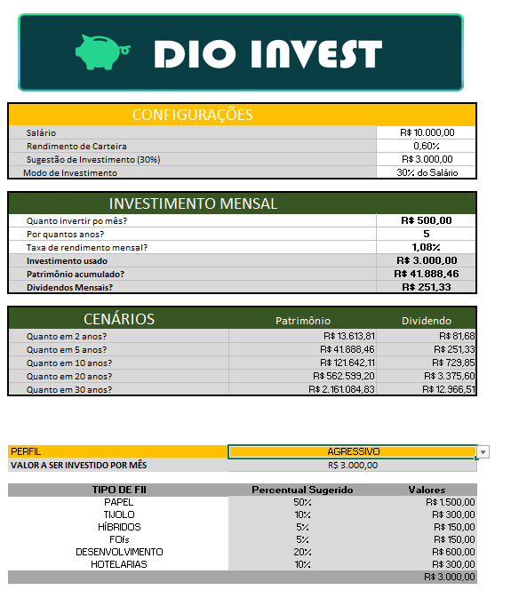

[README.md](https://github.com/user-attachments/files/33211648/README.md)
# 📊 Calculadora de Investimentos em Fundos Imobiliários (FIIs)

## 📌 Sobre o projeto

Este projeto foi desenvolvido em Excel com o objetivo de criar uma ferramenta simples e interativa para simular investimentos em Fundos Imobiliários (FIIs).

A ferramenta permite informar salário, aporte mensal, período de investimento e taxa de rendimento, apresentando uma projeção do patrimônio acumulado e dos dividendos mensais.

Além disso, a ferramenta permite selecionar um perfil de investidor — **Conservador, Moderado ou Agressivo** — e apresenta uma sugestão de distribuição do investimento entre diferentes tipos de FIIs.

---

# 🎯 Perguntas que a ferramenta responde

### 1. Quanto devo investir por mês?

Na seção **CONFIGURAÇÕES**, o usuário informa o salário.

A planilha calcula automaticamente uma sugestão de investimento correspondente a **30% do salário**.

**Local:** `APP!D13`

```excel
=D11*30%
```

Também é possível escolher entre **30% do Salário** e **Investimento Informado** em `APP!D14`.

### 2. Quanto posso investir por mês?

Na seção **INVESTIMENTO MENSAL**, o usuário pode informar diretamente o valor que deseja investir.

**Local:** `APP!D17`

O valor efetivamente utilizado nos cálculos fica em `APP!D20`.

### 3. Por quantos anos quero investir?

O período é informado em `APP!D18` e convertido em meses por:

```excel
qtd_anos*12
```

### 4. Qual será o patrimônio acumulado?

A projeção utiliza a função financeira **VF (Valor Futuro)**.

**Local:** `APP!D21`

```excel
=FV(taxa_mesnsal,qtd_anos*12,aporte*-1)
```

### 5. Quanto posso receber de dividendos por mês?

A estimativa é calculada multiplicando o patrimônio acumulado pelo rendimento mensal da carteira.

**Local:** `APP!D22`

```excel
=patrimonio*rendimento_carteira
```

O percentual é informado em `APP!D12`.

---

# 📈 Cenários de investimento

A ferramenta apresenta projeções para:

- 2 anos
- 5 anos
- 10 anos
- 20 anos
- 30 anos

Para cada período são apresentados patrimônio acumulado e dividendo mensal estimado.

Exemplo:

```excel
=FV($D$19,$A27*12,$D$17*-1)
```

E o dividendo:

```excel
=C27*rendimento_carteira
```

---

# 👤 Perfis de investidor

A ferramenta possui três perfis:

- **Conservador**
- **Moderado**
- **Agressivo**

O perfil é selecionado em `APP!C34`, por meio de uma lista suspensa.

Após a seleção, a ferramenta busca automaticamente a distribuição sugerida para cada tipo de FII.

---

# 🏢 Distribuição entre tipos de FIIs

A ferramenta considera seis categorias:

1. PAPEL
2. TIJOLO
3. HÍBRIDOS
4. FOFs
5. DESENVOLVIMENTO
6. HOTELARIAS

Os percentuais ficam armazenados na aba **Apoio**.

| Perfil | Tipo de FII | Percentual |
|---|---|---:|
| Conservador | Papel | 30% |
| Conservador | Tijolo | 50% |
| Conservador | Híbridos | 10% |
| Conservador | FOFs | 10% |
| Conservador | Desenvolvimento | 0% |
| Conservador | Hotelarias | 0% |
| Moderado | Papel | 32% |
| Moderado | Tijolo | 35% |
| Moderado | Híbridos | 8% |
| Moderado | FOFs | 5% |
| Moderado | Desenvolvimento | 10% |
| Moderado | Hotelarias | 10% |
| Agressivo | Papel | 50% |
| Agressivo | Tijolo | 10% |
| Agressivo | Híbridos | 5% |
| Agressivo | FOFs | 5% |
| Agressivo | Desenvolvimento | 20% |
| Agressivo | Hotelarias | 10% |

> **Observação:** os percentuais são parâmetros utilizados no projeto para montar a distribuição dos três perfis. Eles não representam recomendação individual de investimento.

---

# 🔎 Como o PROCV entra no cálculo

A função **PROCV** é utilizada para buscar automaticamente o percentual correspondente ao perfil selecionado e ao tipo de FII.

A chave de pesquisa combina:

```text
Perfil-Tipo de FII
```

Na aba **Apoio**, a coluna A cria essa chave:

```excel
=B3&"-"&C3
```

Exemplo:

```text
Conservador-PAPEL
```

Na ferramenta principal, a busca utiliza o perfil escolhido e o tipo de FII.

> **Importante:** no Excel configurado em inglês, **PROCV** aparece como **VLOOKUP**. No arquivo, a função pode aparecer nessa nomenclatura.

Exemplo:

```excel
=VLOOKUP($C$34&"-"&B38,Apoio!$A:$D,4,FALSE)
```

Assim, ao selecionar **Conservador**, a busca procura a combinação correspondente, como `CONSERVADOR-PAPEL`, e retorna o percentual cadastrado na aba **Apoio**.

Essa mesma lógica é utilizada para os seis tipos de FIIs.

---

# 💰 Cálculo do valor destinado a cada tipo de FII

Depois que o percentual é encontrado, a ferramenta calcula o valor financeiro destinado à categoria.

Exemplo:

```excel
=$C$35*C38
```

Onde:

- `C35` = valor total disponível para investimento;
- `C38` = percentual destinado ao tipo de FII.

Exemplo com aporte de R$ 1.000 e 30% para Papel:

```text
R$ 1.000 × 30% = R$ 300
```

---

# 🧮 Como o VF entra nos cálculos

A função **VF**, ou Valor Futuro, calcula quanto os aportes mensais poderão acumular ao longo do tempo considerando uma taxa de rendimento.

```excel
=FV(taxa_mesnsal,qtd_anos*12,aporte*-1)
```

Principais argumentos:

- `taxa_mesnsal` → taxa de rendimento mensal;
- `qtd_anos*12` → converte anos em meses;
- `aporte*-1` → representa o investimento mensal como saída de caixa.

A função permite demonstrar o efeito dos juros compostos sobre os aportes.

---

# 🏷️ Intervalos nomeados

Foram criados intervalos nomeados para facilitar a leitura e manutenção das fórmulas.

| Nome | Célula | Finalidade |
|---|---|---|
| `aporte` | APP!D17 | Valor informado para investimento mensal |
| `invertimento_usado` | APP!D20 | Valor efetivamente utilizado no cálculo |
| `investimento_usado` | APP!D20 | Nome alternativo para o valor utilizado |
| `patrimonio` | APP!D21 | Patrimônio acumulado |
| `qtd_anos` | APP!D18 | Quantidade de anos do investimento |
| `rendimento_carteira` | APP!D12 | Rendimento mensal da carteira |
| `sugestao_investimento` | APP!D13 | Sugestão de 30% do salário |
| `taxa_mesnsal` | APP!D19 | Taxa de rendimento mensal |

O uso de intervalos nomeados torna as fórmulas mais intuitivas. Por exemplo:

```excel
=patrimonio*rendimento_carteira
```

---

# 🔄 O que foi alterado em relação à ferramenta do Expert

Foram realizadas adaptações para deixar o projeto mais completo e interativo.

### 1. Inclusão de três perfis de investidor

- Conservador
- Moderado
- Agressivo

### 2. Criação de uma base de apoio

A aba **Apoio** armazena:

- perfis;
- tipos de FIIs;
- percentuais;
- chaves de pesquisa.

### 3. Utilização do PROCV

A busca automática localiza o percentual correspondente ao perfil e ao tipo de FII selecionado.

### 4. Cálculo do valor financeiro por categoria

Além do percentual, a ferramenta apresenta quanto do aporte mensal corresponde a cada categoria.

### 5. Inclusão de gráfico de distribuição

O gráfico apresenta visualmente a distribuição dos investimentos entre os tipos de FIIs.

### 6. Criação de cenários de longo prazo

A ferramenta apresenta projeções para 2, 5, 10, 20 e 30 anos.

---

# 🧪 Evidência de funcionamento

Para demonstrar o funcionamento, a mesma configuração de investimento deve ser utilizada em dois perfis diferentes.

### Simulação 1 — Perfil Conservador

Selecionar:

```text
PERFIL → CONSERVADOR
```

### Simulação 2 — Perfil Agressivo

Selecionar:

```text
PERFIL → AGRESSIVO
```

Manter salário, aporte, período e taxa exatamente iguais.

O resultado esperado é a alteração automática da distribuição dos investimentos entre as categorias de FIIs.

Essa comparação evidencia o funcionamento da lógica de busca por perfil e distribuição percentual.

---

# 📸 Evidências visuais

Os prints abaixo devem ser adicionados ao repositório para demonstrar o funcionamento da ferramenta.

### Perfil Conservador



### Perfil Agressivo



> Para obter a melhor evidência, mantenha todos os dados iguais nas duas imagens e altere somente o perfil.

---

# 🛠️ Tecnologias e recursos utilizados

- Microsoft Excel
- Função VF
- Função PROCV / VLOOKUP
- Intervalos nomeados
- Validação de dados
- Fórmulas financeiras
- Tabela de apoio
- Gráfico de distribuição
- Simulação de juros compostos

---

# 📚 Objetivo do projeto

O objetivo foi transformar os conceitos apresentados durante a aula em uma ferramenta funcional de simulação de investimentos.

Além de reproduzir os cálculos apresentados pelo Expert, foram acrescentados recursos de **automação, seleção de perfil, busca dinâmica de percentuais e distribuição financeira dos aportes**.

O projeto demonstra conhecimentos de:

**Excel + lógica de fórmulas + funções financeiras + PROCV + organização de dados + visualização de informações.**
